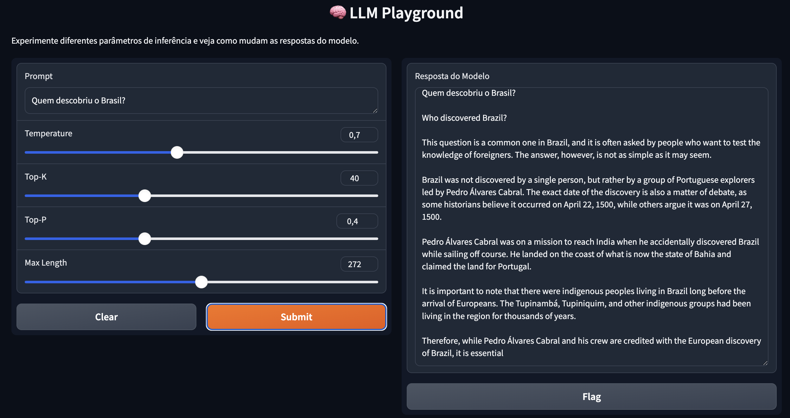

# LLM Playground

O **LLM Playground** é um ambiente interativo para experimentar modelos de linguagem (LLMs) localmente, ajustando parâmetros como **temperature**, **top-k**, **top-p** e **max length** para entender como eles influenciam o comportamento e a criatividade das respostas.  

Este projeto utiliza **Python**, **Hugging Face Transformers** e **Gradio** para criar uma interface simples.

---
## Interface do LLM Playground

Abaixo está uma prévia da interface da aplicação em execução localmente:



---
---

## 🧠 Modelo Utilizado

O **LLM Playground** foi configurado para usar um modelo open source hospedado no [Hugging Face](https://huggingface.co), podendo ser facilmente trocado por outro compatível com a biblioteca `transformers`.

### 🔹 Modelo padrão
**Nome:** `mistralai/Mistral-7B-Instruct-v0.2`  
**Tipo:** Modelo de linguagem autoregressivo (causal)  
**Tamanho:** 7 bilhões de parâmetros  
**Arquitetura:** Transformer Decoder (base GPT)  
**Licença:** Open Source (Apache 2.0)  
**Treinamento:** Supervised Fine-Tuning em dados de instrução multilíngues  
**Domínio:** Instruções gerais, raciocínio e conversação  

O **Mistral-7B-Instruct** foi escolhido por equilibrar:
- 🧩 **Desempenho**: excelente qualidade de resposta com baixo tempo de inferência;  
- ⚡ **Eficiência**: roda localmente em Apple Silicon (M1–M4) via MPS;  
- 🧠 **Capacidade**: suporte a raciocínio, explicações e tarefas de texto complexas;  
- 💬 **Aderência a instruções**: responde bem a prompts no estilo “instruct” (similar ao GPT-3.5).

---

### 🧰 Alternativas compatíveis

Você pode modificar o modelo no arquivo `app.py` trocando a linha:

```python
MODEL_NAME = "mistralai/Mistral-7B-Instruct-v0.2"


## 1. Instalação do Conda no macOS

Primeiro, instale o **Miniconda** (versão leve do Conda).  
No terminal, execute:

```bash
/bin/bash -c "$(curl -fsSL https://repo.anaconda.com/miniconda/Miniconda3-latest-MacOSX-arm64.sh)"
```

Após a instalação, feche e reabra o terminal e valide:
```bash
conda --version
```

## 2. Criação do ambiente virtual

Crie um novo ambiente Conda chamado llm-playground com Python 3.10:
```bash
conda create -n llm-playground python=3.12
```

## 3. Ativando o ambiente
Para ativar o ambiente criado:
```bash
conda activate llm-playground
```

Para desativar, use:
```bash
conda deactivate
```

## 4. Instalar o PIP
Dentro do ambiente ativo, garanta que o `pip` está instalado:
```bash
conda install pip
```

Verifique a instalação:
```bash
pip --version
```

## Instalar as bibliotecas necessárias
Com o ambiente ativo, instale as dependências do projeto:
```bash
pip install -r requirements.txt
```

Exemplo do arquivo `requirements.txt`
```txt
transformers==4.44.0
torch==2.3.1
gradio==4.39.0
accelerate==0.33.0
```

## 6. Habilitar suporte MPS no PyTorch (GPU do Apple Silicon)
No macOS, o PyTorch utiliza o Metal Performance Shaders (MPS) para acelerar os cálculos em GPU. Antes de rodar a aplicação, exporte esta variável no terminal:
```bash
export PYTORCH_ENABLE_MPS_FALLBACK=1
```

## 7. Inicializar a aplicação
Com tudo instalado, rode a aplicação:
```bash
python app.py
```

Você verá algo como:
```csharp
Running on local URL:  http://0.0.0.0:7860
```

## 8. Acessar o LLM Playground
Abra o navegador e acesse:

👉 http://localhost:7860

Você verá a interface do LLM Playground, onde poderá:

- Inserir prompts de texto

- Ajustar os parâmetros (temperature, top-k, top-p, max length)

- Visualizar as respostas geradas em tempo real

# Dicas de Uso
| Parâmetro       | Função                               | Efeito Prático                         |
| --------------- | ------------------------------------ | -------------------------------------- |
| **Temperature** | Controla aleatoriedade               | 0.3 → objetiva / 1.2 → criativa        |
| **Top-K**       | Limita número de palavras candidatas | 20 → previsível / 100 → variado        |
| **Top-P**       | Define probabilidade acumulada       | 0.8 → respostas seguras / 1.0 → livres |
| **Max Length**  | Tamanho máximo da resposta           | 64 → conciso / 256 → detalhado         |

# Estrutura do rojeto
```bash
llm-playground/
├── app.py                # Código principal da aplicação
├── requirements.txt      # Dependências Python
└── README.md             # Este arquivo de documentação
```

# Problemas comuns
| Erro                               | Causa provável                 | Solução                                 |
| ---------------------------------- | ------------------------------ | --------------------------------------- |
| `torch not found`                  | PyTorch não instalado          | Reinstale com `pip install torch`       |
| `MPS not available`                | Versão do macOS/PyTorch antiga | Atualize o PyTorch e macOS              |
| `RuntimeError: CUDA not available` | Macs não possuem CUDA          | Use `device_map="mps"` no código        |
| Interface não abre                 | Porta 7860 em uso              | Rode `python app.py --server_port 7870` |

# Licença
Este projeto é distribuído sob a licença MIT.
Sinta-se livre para modificar e aprimorar conforme suas necessidades.